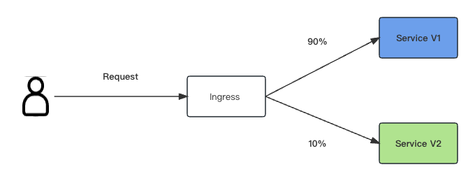

### 背景

现如今，越来越多的应用采用了微服务架构，这也导致了应用数量相比传统模式更多，管理更加复杂，发布更加频繁，如果直接将新版本上线发布给全部用户。一旦遇到线上事故（或BUG），对用户的影响极大，解决问题周期较长，甚至有时不得不回滚到前一版本，严重影响了用户体验。为了保证整体系统的稳定，风险降到最低，我们可以采用灰度发布与蓝绿发布等不同的发布方式。  

### 什么是金丝雀发布

金丝雀发布，又称灰度发布，是指通过让小部份用户流量引入的新版本进行测试，如果一切顺利，则可以增加（可能逐渐增加）百分比，逐步替换旧版本。如在过程中出现任何问题，则可以中止并快速回滚到旧版本。最简单的方式是随机选择百分比请求到金丝雀版本，但在更复杂的方案下，则可以基于请求的内容、特定范围的用户或其他属性等。

### 什么是蓝绿发布

蓝绿发布，提供了一种零宕机的部署方式，是一种以可观测的方式发布应用的方式，目的减少发布过程中停止时间。在保留老版本的同时部署新版本，将两个版本同时在线，新版本和老版本相互热备，通过切换路由权重的方式（非0即100）实现应用的不同版本上线或者下线，如果有问题可以快速地回滚到老版本。这样做的好处是无需停机，并且风险较小。

### 示例应用部署

```bash
[root@k8s-master kube-nginx]# kubectl apply -f kube/teal/blue
deployment.apps/kube-blue-demo created
service/kube-blue-demo-svc created
ingress.networking.k8s.io/kube-blue-canary created
```

```bash
[root@k8s-master kube-nginx]# kubectl get svc,deploy,pods -n kube-grayscale
# ${k8s-node-ip} 请替换为你自己的
[root@k8s-master kube-nginx]#  echo "${k8s-node-ip} kube.teal.com" >> /etc/hosts
[root@k8s-master kube-nginx]# service network restart
#  访问如下内容说明部署成功！
[root@k8s-master kube-nginx]# curl -i  http://kube.teal.com
{"message":"This is version:blue running in pod kube-blue-demo-66b788d9-22xzs"}
```

到此为止，示例应用与新版本已部署完毕！  

### 基于客户端请求头的流量切分

假设线上已运行了一套对外提供的七层demo应用，此时开发了一些新的功能，需要上线新版本demo应用，但是又不想直接替换成新版本demo应用，而是希望将请求头包含`env=green`的客户端请求转发到新版本demo应用中，进行验证测试新版本demo应用，等测试验证通过并稳定后，可将所有流量从老版本demo应用切换到新版本demo应用中，再平滑地将老版本demo应用下线。创建新版本Ingress：

```bash
[root@k8s-master kube-nginx]# kubectl apply -f kube/teal/green
deployment.apps/kube-green-demo created
service/kube-green-demo-svc created
ingress.networking.k8s.io/kube-green-canary created

//第一种，所有的请求都会被转发到灰度（Canary）版本
nginx.ingress.kubernetes.io/canary: "true"
nginx.ingress.kubernetes.io/canary-by-header: "always"

//第二种，所有的请求都不会被转发到灰度（Canary）版本
nginx.ingress.kubernetes.io/canary: "true"
nginx.ingress.kubernetes.io/canary-by-header: "never"
 
//第三种，如果请求的header头包含"user-id: user_1"，该请求会被转发到灰度（Canary）版本
nginx.ingress.kubernetes.io/canary: "true"
nginx.ingress.kubernetes.io/canary-by-header: "user_id"
nginx.ingress.kubernetes.io/canary-by-header-value: "user_1"
 
//第四种，如果请求的header头包含"user-id: user_2"或"user-id: user-3"或"user-id: user4"，该请求会被转发到灰度（Canary）版
nginx.ingress.kubernetes.io/canary: "true"
nginx.ingress.kubernetes.io/canary-by-header: "user_id" 
#在networking.k8s.io/v1中，canary-by-header的值尽量不用使用下划线“_”。如果使用了，请求头中要使用中横线“-”代替。
nginx.ingress.kubernetes.io/canary-by-header-pattern: "user_2|user-3|user4"
```

测试验证：

```bash
# 请求头为env: green访问到新的版本
[root@k8s-master kube-nginx]# curl -X GET "http://kube.teal.com" -H "env: green"
{"message":"This is version:green running in pod kube-blue-demo-5b66668d9-rbhlb"}

# 其他则访问到老的版本
$ curl http://kube.teal.com
{"message":"This is version:blue running in pod kube-blue-demo-66b788d9-22xzs"}
```

### 基于客户端来源IP的流量切分

假设线上已运行了一套对外提供的七层demo应用，此时开发了一些新的功能，需要上线新版本demo应用，又不想直接替换成新版本demo应用，而是只希望公司内部人员能访问到新版本demo应用中，进行测试验证新版本demo应用，非公司内部人员访问还是访问到老版本应用中。等公司内部人员测试验证通过并稳定后，可将所有流量从老版本demo应用切换到新版本demo应用中，再平滑地将老版本demo应用下线。创建新版本Ingress：

```bash
[root@k8s-master kube-nginx]# kubectl apply -f kube/flow/green
deployment.apps/kube-flow-demo created
service/kube-flow-demo-svc created
ingress.networking.k8s.io/kube-flow-canary created
```

测试验证：

```bash
# 请求头为X-Forwarded-For:123.156.789.123访问到新的版本
[root@k8s-master kube-nginx]# curl  -X GET "http://kube.teal.com" -H "X-Forwarded-For: 123.156.789.123"
{"message":"This is version:flow running in pod kube-flow-demo-68d9786b-1z58s"}

# 其他则访问到老的版本
$ curl http://kube.teal.com
{"message":"This is version:blue running in pod kube-blue-demo-66b788d9-22xzs"}
```

### 基于服务权重的流量切分

假设线上已运行了一套对外提供的七层demo应用，此时修复了一些问题，需要上线新版本demo应用，又不想直接替换成新版本demo应用，而是希望将20%的流量切换新版本。待运行一段时间稳定后，可将所有流量从老版本demo应用切换到新版本demo应用中，再平滑地将老版本demo应用下线。创建新版本Ingress：

```bash
[root@k8s-master kube-nginx]# kubectl apply -f kube/weight/green
deployment.apps/kube-weight-demo created
service/kube-weight-demo-svc created
ingress.networking.k8s.io/kube-weight-canary created
```

测试验证：

```bash
# 可以看出，有4/20的几率由新版本服务响应，符合20%服务权重的设置。
[root@k8s-master kube-nginx]# for i in `seq 20`;do curl -X GET "http://kube.teal.com" ; echo -e "$fruit";done
{"message":"This is version:blue running in pod kube-blue-demo-66b788d9-22xzs"}
{"message":"This is version:blue running in pod kube-blue-demo-66b788d9-22xzs"}
{"message":"This is version:blue running in pod kube-blue-demo-66b788d9-22xzs"}
{"message":"This is version:blue running in pod kube-blue-demo-66b788d9-22xzs"}
{"message":"This is version:weight running in pod kube-weight-demo-15a98d9-q1xlb"}
{"message":"This is version:blue running in pod kube-blue-demo-66b788d9-22xzs"}
{"message":"This is version:blue running in pod kube-blue-demo-66b788d9-22xzs"}
{"message":"This is version:weight running in pod kube-weight-demo-15a98d9-q1xlb"}
{"message":"This is version:blue running in pod kube-blue-demo-66b788d9-22xzs"}
{"message":"This is version:weight running in pod kube-weight-demo-15a98d9-q1xlb"}
{"message":"This is version:weight running in pod kube-weight-demo-15a98d9-q1xlb"}
{"message":"This is version:blue running in pod kube-blue-demo-66b788d9-22xzs"}
{"message":"This is version:blue running in pod kube-blue-demo-66b788d9-22xzs"}
{"message":"This is version:blue running in pod kube-blue-demo-66b788d9-22xzs"}
{"message":"This is version:blue running in pod kube-blue-demo-66b788d9-22xzs"}
{"message":"This is version:blue running in pod kube-blue-demo-66b788d9-22xzs"}
{"message":"This is version:blue running in pod kube-blue-demo-66b788d9-22xzs"}
{"message":"This is version:blue running in pod kube-blue-demo-66b788d9-22xzs"}
{"message":"This is version:blue running in pod kube-blue-demo-66b788d9-22xzs"}
{"message":"This is version:blue running in pod kube-blue-demo-66b788d9-22xzs"}
```

部署全部

```bash
kubectl create ns kube-grayscale
kubectl apply -f kube/flow/
kubectl apply -f kube/weight/
kubectl apply -f kube/teal/blue
kubectl apply -f kube/teal/green
```

### 注解说明

Nginx Ingress支持通过配置注解（Annotations）来实现不同场景下的发布和测试，可以满足灰度发布、蓝绿发布、A/B测试等业务场景。具体实现过程如下：为服务创建两个Ingress，一个为常规Ingress，另一个为带nginx.ingress.kubernetes.io/canary: "true"注解的Ingress，称为Canary Ingress；为Canary Ingress配置流量切分策略Annotation，两个Ingress相互配合，即可实现多种场景的发布和测试。Nginx Ingress的Annotation支持以下几种规则：

- nginx.ingress.kubernetes.io/canary-by-header基于Header的流量切分，适用于灰度发布。如果请求头中包含指定的header名称，并且值为“always”，就将该请求转发给Canary Ingress定义的对应后端服务。如果值为“never”则不转发，可用于回滚到旧版本。如果为其他值则忽略该annotation，并通过优先级将请求流量分配到其他规则。

- nginx.ingress.kubernetes.io/canary-by-header-value必须与canary-by-header一起使用，可自定义请求头的取值，包含但不限于“always”或“never”。当请求头的值命中指定的自定义值时，请求将会转发给Canary Ingress定义的对应后端服务，如果是其他值则忽略该annotation，并通过优先级将请求流量分配到其他规则。

- nginx.ingress.kubernetes.io/canary-by-header-pattern与canary-by-header-value类似，唯一区别是该annotation用正则表达式匹配请求头的值，而不是某一个固定值。如果该annotation与canary-by-header-value同时存在，该annotation将被忽略。

- nginx.ingress.kubernetes.io/canary-by-cookie基于Cookie的流量切分，适用于灰度发布。与canary-by-header类似，该annotation用于cookie，仅支持“always”和“never”，无法自定义取值。

- nginx.ingress.kubernetes.io/canary-weight基于服务权重的流量切分，适用于蓝绿部署。表示Canary Ingress所分配流量的百分比，取值范围[0-100]。例如，设置为100，表示所有流量都将转发给Canary Ingress对应的后端服务。

以上注解规则会按优先级进行评估，优先级为：canary-by-header -> canary-by-cookie -> canary-weight。

### 总结

本文介绍了金丝雀发布与蓝绿发布，并以企业案例的方式讲解了不同的场景使用什么样的发布方式

